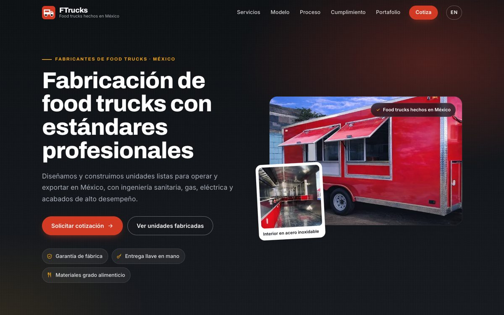
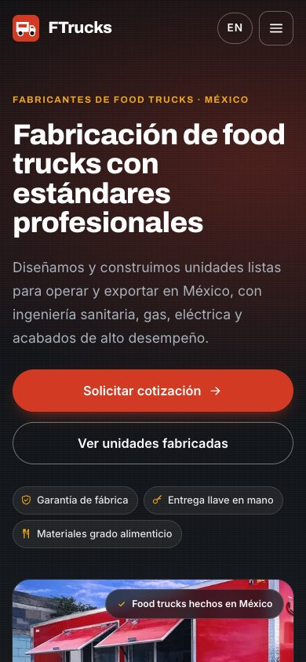

# FTrucks: fabricación de food trucks en México

Landing page bilingüe (español / inglés) para un fabricante mexicano de food trucks y remolques de comida.

**En vivo:** https://gustavolarcodev.github.io/FoodTrucks/





## Características

- **Español / inglés:** diccionario i18n en `script.js`. El botón ES/EN también cambia `lang`, `<title>`, la meta descripción, los textos alternativos y las etiquetas ARIA. La preferencia se guarda en `localStorage` cuando el navegador lo permite.
- **Responsive:** menú móvil con `aria-expanded`, cuadrícula de portafolio tipo mosaico y línea de tiempo vertical en móvil. Sin scroll horizontal desde 360 px.
- **Cotización honesta:** el formulario valida los campos y abre el correo (o WhatsApp, si está configurado) con el mensaje listo. No simula que la solicitud se envió a un servidor.
- **Contacto en un solo lugar:** `WA_NUMBER`, `PHONE` y `EMAIL` al inicio de `script.js`. Mientras `WA_NUMBER` y `PHONE` estén vacíos, los botones de WhatsApp y el teléfono no se muestran.
- **Galería con lightbox:** usa `<dialog>` nativo y se maneja con teclado (Esc y flechas).
- **Accesible:** skip link, landmarks, `aria-labelledby` en secciones, anillos `:focus-visible`, contraste AA y animaciones desactivadas con `prefers-reduced-motion`.
- **SEO:** Open Graph y Twitter Card, canonical, JSON-LD, favicon SVG, `robots.txt` y `sitemap.xml`.
- **Ligero:** sin dependencias ni paso de build. La primera carga pesa unos 330 KB (antes eran unos 11 MB).

## Imágenes

Las fotos del portafolio se recortaron de los anuncios promocionales originales para mostrar solo las unidades, sin textos encima, y se exportaron a WebP (`Images/fotos/`).

## Stack

HTML, CSS y JavaScript sin frameworks. Tipografías Archivo e Inter (Google Fonts).

## Ejecutar localmente

```bash
python3 -m http.server 8000
# abre http://localhost:8000
```

## Despliegue

GitHub Pages sirve el sitio desde la raíz de la rama `main`. `.nojekyll` desactiva el procesamiento de Jekyll. Todas las rutas son relativas y distinguen mayúsculas (`Images/`).

---

### English summary

FTrucks is a bilingual (ES/EN) landing page for a Mexican food-truck manufacturer. It is built with plain HTML, CSS and vanilla JS, with no build step, and is deployed on GitHub Pages. It is responsive down to 360 px and accessible (skip link, focus rings, reduced motion). It includes a lightbox gallery, SEO metadata and a quote form that hands off to email (or WhatsApp once a number is configured in `script.js`). The images are optimized WebP crops, so the first load is about 330 KB instead of about 11 MB.
